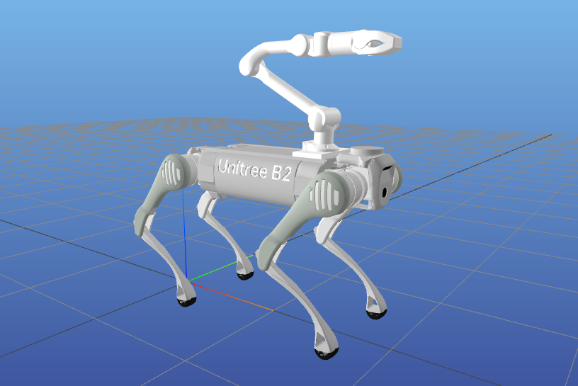

# Loco-manipulation with Pinocchio



## Setup

Create Conda environment, install Pinocchio and MeshCat:

```bash
conda create -n pino python=3.12
conda activate pino
conda install pinocchio meshcat-python -c conda-forge
```

## Examples

- OCP and MPC: Track desired COM momentum (linear + angular). Gait sequence is parametrized, swing legs track bezier curves in z-direction and optimize in x/y-directions.

### Optimal Control Problem

- Uses casadi Opti stack with MX expressions. Pinocchio uses SX expressions, which are converted to MX using casadi Functions.
- Solver: FATROP with auto-structure detection
- Code generation: Compile solver function (see codegen folder)

### Centroidal Dynamics

- State: Centroidal momentum, generalized coordinates
- Input: Ground reaction forces, joint velocities (base velocity is calculated through the centroidal momentum matrix)

## Old Examples

- COM: Move center of mass up and down, while arm end effector position remains constant.
- IK: Given desired arm end effector position and rotation, compute whole-body joint angles.
- Casadi: Formulate optimization problem in joint space (states: joint positions, inputs: joint velocities). Track desired goal state.
