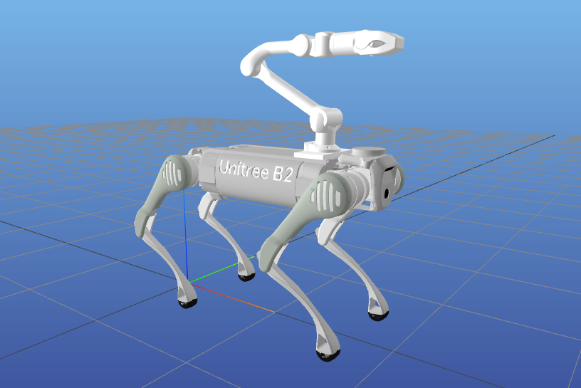
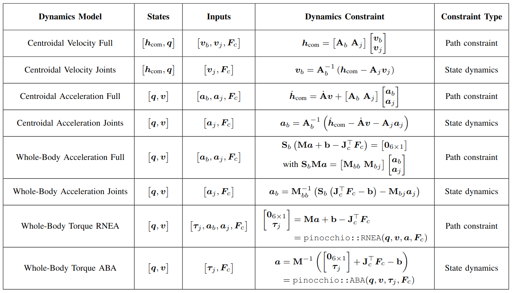

# Loco-manipulation with Pinocchio



## Setup

Create Conda environment, install Pinocchio and MeshCat:

```bash
conda create -n pino python=3.12
conda activate pino
conda install pinocchio meshcat-python -c conda-forge
```

If using OSQP solver:

```bash
conda install osqp -c conda-forge
```

## Examples

Run OCP and MPC examples with:

```bash
python run_mpc.py
```

In the example files define:
- Robot: B2, B2G (with Z1 arm), Go2
- Dynamics: centroidal_vel, centroidal_acc, whole_body_acc, whole_body_rnea, whole_body_aba
- Gait: Type and period
- Targets: Base velocity (linear + angular), external force, end-effector velocity (linear)
- Swing params: Max height and takeoff/touchdown velocities
- Solver options: Type, warm-starting, code-compilation

## Optimal Control Problem

The OCP is formulated with the casadi Opti stack. This uses MX expressions, whereas Pinocchio uses SX expressions. For this reason all relevant Pinocchio expressions used in the constraints are converted to MX using casadi Functions.

These are the following dynamics choices for the OCP:



The file `ocp_args.py` contains additional arguments for each dynamics choice. For example, `include_base=True` adds the base variable to the input (for the velocity and acceleration formulations). The dynamics are then ensured through a path constraint on each node, rather than propagating the base dynamics through the state.

## Solvers

### Fatrop

Directly solves the constrained nonlinear optimization problem. Uses auto-structure detection, which significantly reduces the solve time compared to Ipopt. The solver is warm-started with the MPC solution from the previous step. 

Code generation: The Fatrop solver can be exported to a C file and compiled to a shared library (see codegen folder). For hardware deployment the solver can be loaded with `casadi::external`.

### OSQP

The Opti formulation is converted to a Sequential Quadruatic Program (SQP). Each SQP iteration is solved with OSQP, and the solution is updated using the Armijo line-search method.

Code generation: The SQP matrices and vectors can be compiled to a shared library (see codegen folder). For hardware deployment they can be loaded with `casadi::external`. The OSQP setup and solve needs to be formulated in C++ like it is done here.
